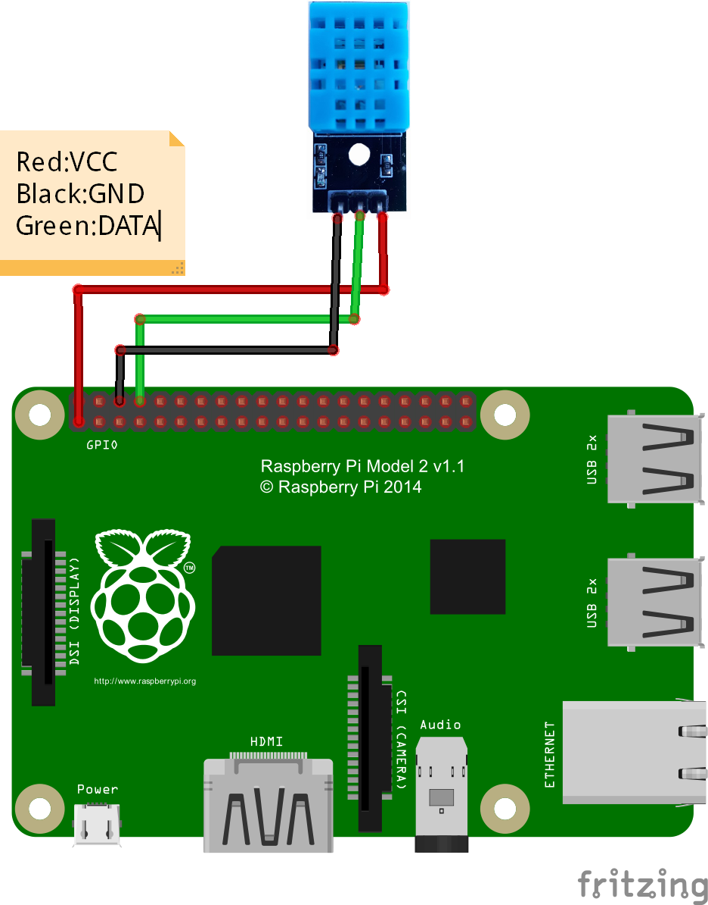
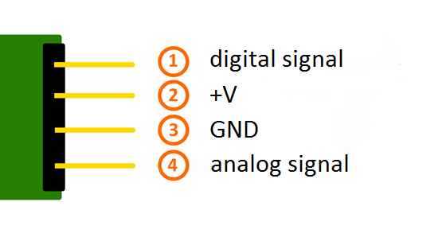

<h2 id='gpio'>RPI3 GPIO Pin Mappings</h2>
  
  

<h2 id='l298n'>Control motors by L298N</h2>
* Basic usage of L298N to control motors forward and backward:
    * http://www.piddlerintheroot.com/l298n-dual-h-bridge/
    * http://www.explainingcomputers.com/rasp_pi_robotics.html  
* Advanced usage of L298N to control the speed of motors:  
    * https://diyhacking.com/control-a-dc-motor-with-an-l298-controller-and-raspberry-pi/   
* Programming to use keyborad to control the motors:
    * Python curses package: https://docs.python.org/2/library/curses.html#constants  
    * Python pygame package: https://www.pygame.org/docs/  
    * Install pygame on Mac: https://gist.github.com/connorshea/f539c91f210e72077ca9  
    https://github.com/pygame/pygame/issues/359  
        * ```pip install pygame```  
        * ```pythonw -m pygame.examples.aliens```
* I use sublime to sync codes on my laptop with PI
    * https://www.youtube.com/watch?v=g6NqBGHFfm0
* [code sample](codes/control.py) to control RC car by keyboard.

<h2 id='HC-SR04'>HC-SR04 Ultrasonic Rangefinder</h2>
reference:  
https://www.youtube.com/watch?v=sXJjfEisjpo  
https://www.modmypi.com/blog/hc-sr04-ultrasonic-range-sensor-on-the-raspberry-pi  
 

<h2 id='DHT11'>DHT11</h2>
reference:  
http://osoyoo.com/2017/03/21/%E6%A0%91%E8%8E%93%E6%B4%BE%E8%AF%BB%E5%8F%96dht11/  
 

<h2 id='KY-037'>KY-037</h2>
reference:  
http://sensorkit.en.joy-it.net/index.php?title=KY-037_Microphone_sensor_module_(high_sensitivity)  
 

<h2 id='FC-04'>FC-04</h2>
reference:
http://www.instructables.com/id/Using-a-sound-sensor-with-a-Raspberry-Pi-to-contro/

<h2 id='sound'>Sound Detector</h2>
reference:  
https://www.youtube.com/watch?v=GiXNUYPrQ7I  
