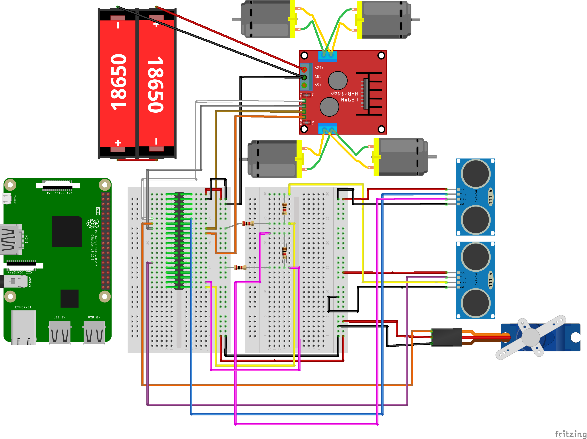
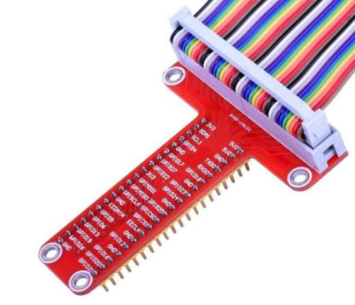

<h2 id='circuit'>Demo</h2>

<h2 id='component'>Component list</h2>

Here are the components I prepared, most I bought on Taobao. Here I give Amazon link for reference.  
- 1 * [L298N Motor Drive Controller Board](https://www.amazon.com/Qunqi-Controller-Module-Stepper-Arduino/dp/B014KMHSW6/ref=sr_1_4?ie=UTF8&qid=1516955171&sr=8-4&keywords=L298N)
- 4 * [HC-SR04 Ranging Detector / Ultrasonic Sensor](https://www.amazon.com/SainSmart-HC-SR04-Ranging-Detector-Distance/dp/B004U8TOE6/ref=sr_1_16?s=electronics&ie=UTF8&qid=1516955231&sr=1-16&keywords=HC-SR04)
- 5 * [SG90 Micro Servo Motor](https://www.amazon.com/J-Deal%C2%AE-Micro-Helicopter-Airplane-Controls/dp/B00X7CJZWM/ref=sr_1_2_sspa?s=toys-and-games&ie=UTF8&qid=1516955328&sr=1-2-spons&keywords=9g+servo&psc=1)
- 2 * [400-point Experiment Breadboard](https://www.amazon.com/microtivity-400-point-Experiment-Breadboard-Jumper/dp/B004RXKWDQ/ref=sr_1_3?s=toys-and-games&ie=UTF8&qid=1516955374&sr=1-3&keywords=breadboard)
- 1 * [5v 2a battery bank](https://www.amazon.com/KMASHI-15000mAh-External-Portable-Powerful/dp/B00JP8MZGK/ref=sr_1_2?s=electronics&ie=UTF8&qid=1516955437&sr=1-2&keywords=5v+2a+battery+package)
- 2 * [18650 Li-ion battery](https://www.amazon.com/Panasonic-NCR18650B-Rechargeable-Battery-Transport/dp/B01C4GFVN8/ref=sr_1_11?s=electronics&ie=UTF8&qid=1516955501&sr=1-11&keywords=18650+battery)
- 1 * [Portable Wireless Bluetooth Speaker](https://www.amazon.com/A2-LENRUE-Bluetooth-Handsfree-Smartphone/dp/B071WYXY6B/ref=sr_1_1?s=electronics&ie=UTF8&qid=1516955578&sr=1-1&keywords=lenrue)
- 1 * [RPi CSI camera](https://www.amazon.com/Arducam-Megapixels-Sensor-OV5647-Raspberry/dp/B012V1HEP4/ref=sr_1_4?s=electronics&ie=UTF8&qid=1516955649&sr=1-4&keywords=RPi+camera)
- 1 * [camera extension cable 50cm](https://www.amazon.com/Miuzei-Extension-Ribbon-Raspberry-Camera/dp/B072N7VXPR/ref=sr_1_2?s=electronics&ie=UTF8&qid=1516955715&sr=1-2&keywords=RPi+camera+extension)
- 1 * [T Type GPIO Adapter](https://www.amazon.com/Kuman-Breakout-Expansion-Assembled-Raspberry/dp/B0761NYF6Y/ref=sr_1_2?s=electronics&ie=UTF8&qid=1516955854&sr=1-2&keywords=RPi+T-)
- 1 * [Battery Storage Case for 2 X 18650 battery](https://www.amazon.com/SACKORANGE-Plastic-Battery-Storage-Holder/dp/B06XT1DM74/ref=sr_1_16?s=electronics&ie=UTF8&qid=1516955933&sr=1-16&keywords=18650+battery+case)
- 1 * [Camera Mount](https://www.amazon.com/Platform-Anti-Vibration-Dampener-Quadcopter-Crazepony/dp/B075N6TPWL/ref=sr_1_2?s=electronics&ie=UTF8&qid=1516956132&sr=1-2&keywords=camera+servo+mount)
- 1 * [Misc, suggest such kind package](https://www.amazon.com/Elegoo-EL-CK-002-Electronic-Breadboard-Potentiometer/dp/B01ERP6WL4/ref=sr_1_4?s=electronics&ie=UTF8&qid=1516956170&sr=1-4&keywords=resistor+kit)
- 1 * [RPi 3 b+](https://www.amazon.com/Raspberry-Pi-RASPBERRYPI3-MODB-1GB-Model-Motherboard/dp/B01CD5VC92/ref=sr_1_3?s=electronics&ie=UTF8&qid=1516956538&sr=1-3&keywords=raspberry+pi+3)
- 1 * RC car kit

<h2 id='circuit'>Circuit diagram</h2>

 

Please notes:  
- I don't draw out the audio player, camera, which are easy to be plunge in by yourself.
- I just draw out one servo and two ultra sonic sensor to keep the diagram clear.  
- In realistic, I have a T-Type GPIO Adapter like below mapping the GPIO pins to the breadboard, so in the diagram, 
I place a RPi header on the left side breadboard.

 

I suggest checking [the sketch](#Fritzing_sketch.fzz) by [Fritzing](http://fritzing.org/home/) desktop.

<h2 id='introduction'>Brief introduction</h2>

<h2 id='reference'>Reference</h2>

[Here](#Reference.md) is the reference resource I collected during the project.

