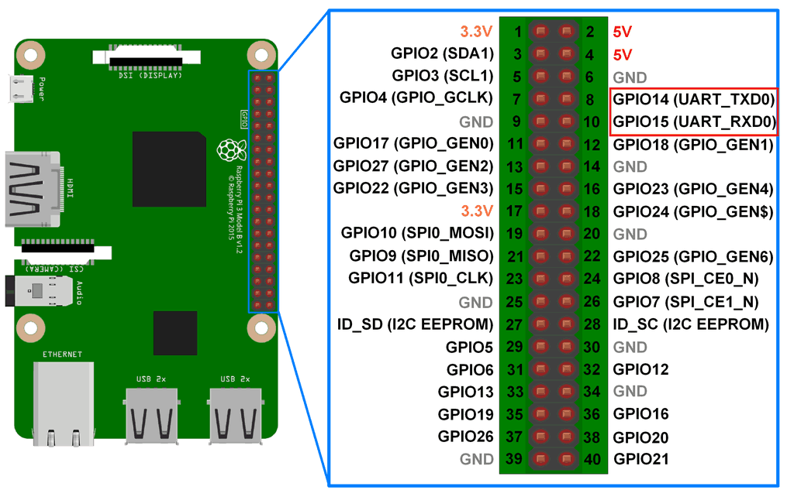

<h2 id='gpio'>RPI3 GPIO Pin Mappings</h2>

https://pinout.xyz/

<p align="center">
<br>
<br>
</p>


<h2 id='l298n'>Control motors by L298N</h2>

* Basic usage of L298N to control motors forward and backward:
    * http://www.piddlerintheroot.com/l298n-dual-h-bridge/
    * http://www.explainingcomputers.com/rasp_pi_robotics.html    
* Programming to use keyborad to control the motors:
    * Python curses package: https://docs.python.org/2/library/curses.html#constants  
    
There is two ways to control the motor speed. One is PWM changing on the INPUT pin as the below code snippet.
The other is using the enable PIN to change PWM, as [this code](https://github.com/custom-build-robots/Motor-Driver-L298N-H-Bridge/blob/master/L298NHBridge.py)
implemented. There is a [post](https://www.raspberrypi.org/forums/viewtopic.php?f=37&t=90243) comparing these two solutions.  
```python
#!/usr/bin/env python3
"""infinitely loop the motor to speed up and down"""
import time
import RPi.GPIO as GPIO
GPIO.setmode(GPIO.BCM)
GPIO.setup(23, GPIO.OUT)
GPIO.setup(24, GPIO.OUT)
p = GPIO.PWM(23, 50) 
p.start(0)
GPIO.output(24, False)
try:
    while 1:
    	# low to high
        for dc in range(0, 101, 5):
            p.ChangeDutyCycle(dc)
            time.sleep(0.2)
        # high to low
        for dc in range(100, -1, -5):
            p.ChangeDutyCycle(dc)
            time.sleep(0.2)
except KeyboardInterrupt:
    pass
p.stop()
GPIO.cleanup()
```
* check [here](http://www.toptechboy.com/raspberry-pi/raspberry-pi-lesson-27-analog-voltages-using-gpio-pwm-in-python/)
for PWM programming on RPi. [GPIO document](https://sourceforge.net/p/raspberry-gpio-python/wiki/PWM/) here.
[pigpio package](http://abyz.me.uk/rpi/pigpio/python.html) also implements controling PWM.

<h2 id='DHT11'>DHT11</h2>

Example code and tutorial:  
http://osoyoo.com/2017/03/21/%E6%A0%91%E8%8E%93%E6%B4%BE%E8%AF%BB%E5%8F%96dht11/  
<p align="center">
Diagram<br>
<br>
Demo<br>
<br>
</p>

<h2 id='TCRT5000'>TCRT5000</h2>

Example code and tutorial:  
* https://raspberrytips.nl/tcrt5000/  
* https://github.com/the-raspberry-pi-guy/robot  

<p align="center">
<br>
Demo<br>
<br>
</p>

<h2 id="servo">Servo</h2>

* tutorial:  
    * Servo control: https://www.youtube.com/watch?v=N5QmZ92uvUo  
    * Servo platform installation: http://v.youku.com/v_show/id_XODk3NDE1NjYw.html  

<h2 id='HC-SR04'>HC-SR04 Ultrasonic Rangefinder</h2>

reference:  
* https://www.youtube.com/watch?v=sXJjfEisjpo  
* https://www.modmypi.com/blog/hc-sr04-ultrasonic-range-sensor-on-the-raspberry-pi  
* https://raspberrytips.nl/hc-sr04-ultrasone-sensor/  
* https://gist.github.com/raspberrytipsnl/85cb7807340bede2279b12f950aef5cb  
* https://stackoverflow.com/questions/45488233/controlling-continuous-servo-using-python-in-raspberry-pi-but-the-continuous-ser

<p align="center">
Circuit diagram<br>
<br>
Implementation<br>
<br>
<br>  
<br>  
Demo<br>
<br>  
</p>

<h2 id='Flask_Web_Server'>Flask Web Server</h2>

* https://randomnerdtutorials.com/raspberry-pi-web-server-using-flask-to-control-gpios/  
* http://mattrichardson.com/Raspberry-Pi-Flask/
* http://nessy.info/?p=1136
* http://vladikk.com/2013/09/12/serving-flask-with-nginx-on-ubuntu/  

<h2 id="NRF24L01">NRF24L01</h2>

* http://thezanshow.com/electronics-tutorials/raspberry-pi/tutorial-32-33  
* https://github.com/BLavery/lib_nrf24  
* SPI and I2C tutorial: https://learn.sparkfun.com/tutorials/raspberry-pi-spi-and-i2c-tutorial

<h2 id='KY-037'>KY-037</h2>

reference:  
http://sensorkit.en.joy-it.net/index.php?title=KY-037_Microphone_sensor_module_(high_sensitivity)  
<br>

<h2 id='FC-04'>FC-04</h2>

reference:
http://www.instructables.com/id/Using-a-sound-sensor-with-a-Raspberry-Pi-to-contro/

<h2 id='sound'>Sound Detector</h2>

reference:  
https://www.youtube.com/watch?v=GiXNUYPrQ7I  

<h2 id='heart_rate'>Heart Rate module</h2>

* MCP3008 is required
* https://pulsesensor.com/

<h2 id='speaking'>Make RPi speak</h2>

Setting ```audio_pwm_mode=2``` in ```/boot/config.txt``` can reduce the background noise for audio from 3.5mm jack.

If you want to set usb sound card for RPi3 as default sound output.  
- check the device number by ```aplay -l```  
- add below lines to ```/etc/asound.conf```   
```
pcm.!default {
    type hw
    card 1
}

ctl.!default {
    type hw           
    card 1
}
```

- verify as:

```aplay -D plughw:1,0  /usr/share/sounds/alsa/*```

```omxplayer -b -o alsa:hw:1,0  xxx.mp3```

Install ```espeak``` on RPi, refer to: 

- https://www.dexterindustries.com/howto/make-your-raspberry-pi-speak/
- https://www.devdungeon.com/content/text-speech-python-espeak

- volumn control:  
http://blog.scphillips.com/posts/2013/01/sound-configuration-on-raspberry-pi-with-alsa/

- Install espeak lib for python3 as 
```sudo apt-get install espeak python-espeak```

<h2 id='pi-shutdown-button'>Control Pi start, shutdown, reboot with one button</h2>

- https://gilyes.com/pi-shutdown-button/
- threaded callback function: https://sourceforge.net/p/raspberry-gpio-python/wiki/Inputs/

<h2 id="camera">Camera</h2>

- Amazing recipes for RPi camera: https://picamera.readthedocs.io/en/release-1.13/recipes1.html
- Flask server solution to stream camera video: https://github.com/miguelgrinberg/flask-video-streaming


<h2 id='KY-022'>KY-022(IR sensor)</h2>

reference:  
- wire connection: http://sensorkit.en.joy-it.net/index.php?title=KY-022_Infrared_receiver_module#Code_example_Raspberry_Pi
- IR receiver code in python: http://abyz.me.uk/rpi/pigpio/examples.html#Python%20code (see "IR Receiver")